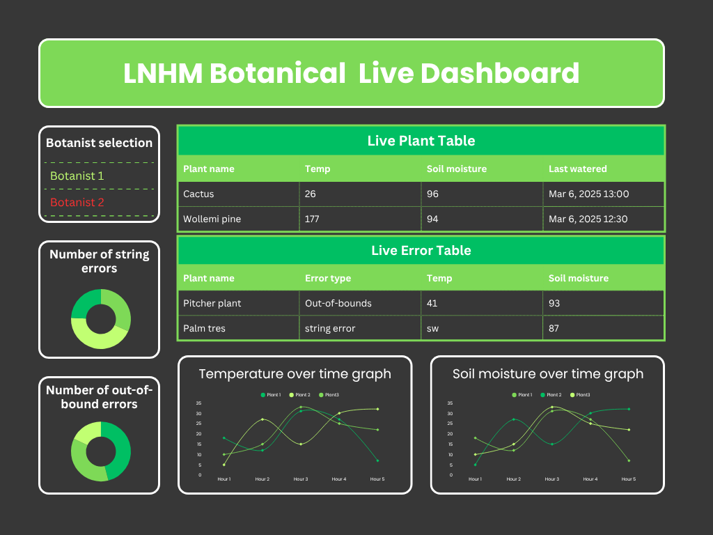
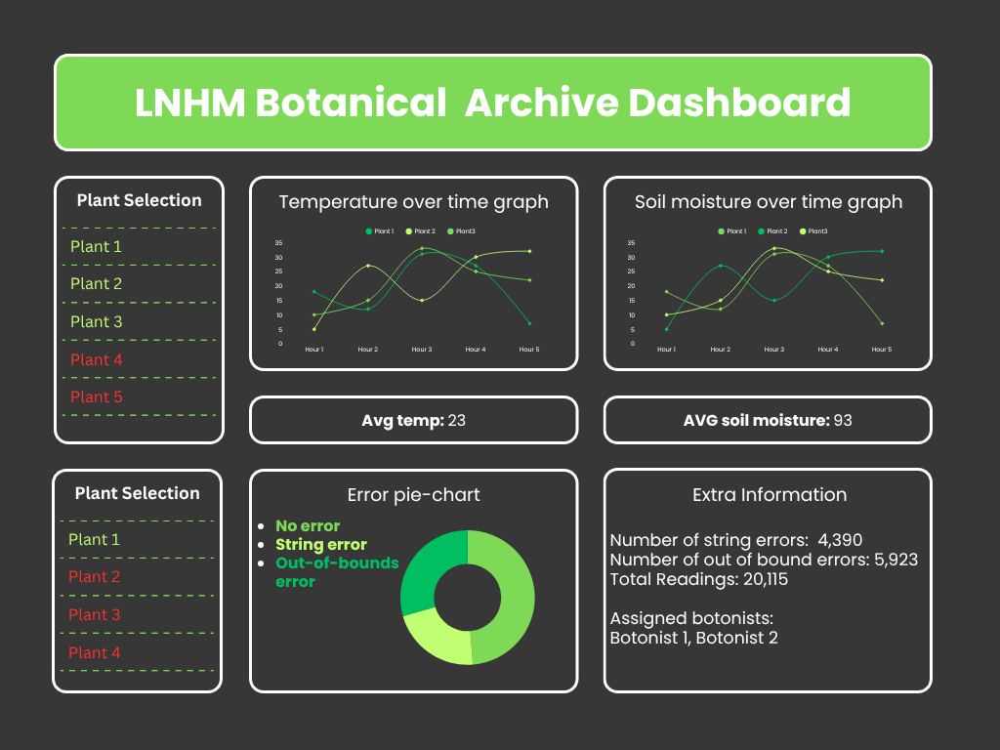

# `/dashboard`

The files for running the plant-sensor dashboard.

## Setup

## Structure Explanation

Streamlit looks for a `pages/` folder for multipage apps, it seems that any python files in this folder are converted into pages.

We can store resources (e.g. functions for making charts) in the resources folder and pull these through onto the pages as we need.

Also included is `/homepage.py` which is what actually runs the dashboard.

## Developer Resources
[Streamlit multipage apps documentation](https://docs.streamlit.io/develop/concepts/multipage-apps/overview#page-terminology)  
[Streamlit `pages/` directory documentation](https://docs.streamlit.io/develop/concepts/multipage-apps/pages-directory)

## Wireframe
### LNHM Botanical Live Dashboard Page

### LNHM Botanical Archive Dashboard Page

## Dashboard Requirements

- To be able to view the data in real-time
- View graphs of the latest temperature and moisture readings for every plant
- To be able to view the data from the long-term storage